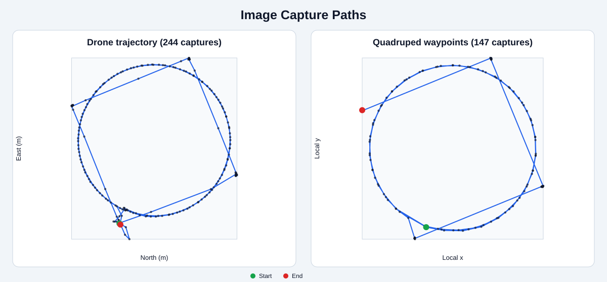

# Cultural Heritage 3D Reconstruction

> **Work in progress** - A team capstone project for reconstructing Korean cultural heritage sites from real-world imagery.

## Overview

This project investigates a practical 3D reconstruction pipeline for documenting cultural heritage architecture. Images of the **Seooreung Jeongjagak heritage structure** are collected from complementary viewpoints using a drone and a quadruped robot, then processed with Gaussian Splatting-based reconstruction methods.

The broader goal is to evaluate how aerial and ground-level observations can be combined to produce a detailed, navigable 3D representation of a real cultural heritage site.

## Interactive 3D Results

The reconstructed scenes can be explored directly in a web browser:

| Capture source | Scene | Description |
|---|---|---|
| Drone | [Open `interval_1s` in SuperSplat](https://superspl.at/scene/9cdce44b) | Reconstruction generated from imagery sampled along the drone trajectory at approximately 1 frame per second |
| Quadruped robot | [Open `waypoint` in SuperSplat](https://superspl.at/scene/6dd7a28b) | Reconstruction generated from images captured at planned ground-level waypoints |

These interactive viewers provide direct qualitative evidence of the current reconstruction results and allow free-viewpoint inspection of coverage, geometry, and visible artifacts.

## Sample Capture Metadata

This public repository includes two small metadata samples used to document the image-acquisition paths:

- [`poses(1IPS).csv`](./poses(1IPS).csv): 244 timestamped drone poses in the PX4 NED coordinate frame, including position, altitude, heading, and camera-orientation fields.
- [`waypoint_dataset.csv`](./waypoint_dataset.csv): 147 quadruped-robot waypoint captures, including image filenames, local positions, yaw, scan layer, and camera tilt.

The CSV files contain local trajectory and capture metadata only. Raw site images are not included.

## Reproducible Capture-Path Visualization



The included dependency-free Python utility reads both public CSV files and regenerates the trajectory figure:

```bash
python visualize_capture_paths.py
```

Optional paths can be supplied explicitly:

```bash
python visualize_capture_paths.py \
  --drone "poses(1IPS).csv" \
  --waypoints waypoint_dataset.csv \
  --output capture_paths.svg
```

The script validates the required coordinate columns, skips invalid numeric rows, preserves equal axis scaling, and marks the start and end of each capture sequence.

## Public Viewer Utilities

The [`tools/`](./tools) directory contains cleaned, reusable versions of the project's reconstruction viewers:

- [`visualize_colmap_and_3dgs.py`](./tools/visualize_colmap_and_3dgs.py): displays COLMAP sparse points, registered camera poses and frustums, optional source-image thumbnails, and the 3DGS PLY in one interactive Viser scene.
- [`render_3dgs_viewer.py`](./tools/render_3dgs_viewer.py): rasterizes a standard 3DGS PLY interactively using CUDA, PyTorch, `gsplat`, Nerfview, and Viser.

See [`tools/README.md`](./tools/README.md) for input requirements, installation notes, and example commands. Lightweight dependencies are listed in [`requirements-viewers.txt`](./requirements-viewers.txt); CUDA-enabled PyTorch and `gsplat` must be installed separately.

## System Pipeline

```text
Drone imagery + Quadruped-robot imagery
                    |
                    v
        Data organization and preprocessing
                    |
                    v
        Camera pose estimation / scene setup
                    |
                    v
        Gaussian Splatting training
                    |
                    v
        Novel-view rendering
                    |
                    v
        Reconstruction quality evaluation
```

## Project Components

### Data Acquisition

- Aerial imagery collected from a drone
- Ground-level imagery collected using a quadruped robot
- Multi-view observations designed to cover architectural details from complementary perspectives

### 3D Reconstruction

- Dataset preparation and image organization
- Gaussian Splatting-based scene reconstruction
- Training and rendering pipeline configuration
- Novel-view rendering for qualitative inspection

### Evaluation

The project considers both visual quality and reconstruction reliability. Evaluation work includes:

- Qualitative comparison of rendered views
- Inspection of missing or poorly reconstructed regions
- Analysis of viewpoint coverage
- Reconstruction quality assessment using available image-based metrics

## My Contributions

My work focuses on the reconstruction side of the project:

- Organizing and preparing captured image data for reconstruction
- Building and running the Gaussian Splatting training and rendering pipeline
- Inspecting reconstructed scenes and rendered novel views
- Supporting reconstruction quality evaluation and experiment documentation
- Coordinating the connection between data acquisition and 3D reconstruction stages

## Research Motivation

Cultural heritage reconstruction presents practical challenges that are less visible in curated benchmark datasets:

- Limited access to some viewpoints
- Occlusion around roofs, pillars, and narrow structural regions
- Different image characteristics between aerial and ground platforms
- The need to balance reconstruction quality with realistic data-collection constraints

This project provides hands-on experience with real-world 3D vision, multi-platform data acquisition, scene representation, and reconstruction evaluation.

## Current Status

The project is currently in progress. The team is iterating on:

- Image coverage and data quality
- Reconstruction and rendering settings
- Evaluation methodology
- Integration of drone and quadruped-robot observations

Additional technical details and evaluation results will be added after the experiments are finalized and approved for public release.

## Repository Scope

This is a **public portfolio repository** that summarizes the project and my contributions. The original team repositories, raw datasets, internal reports, and unpublished implementation details are not included because they are managed separately as part of the capstone project.

No private team code, raw cultural-heritage dataset, model checkpoints, or internal course materials are published here.

## Technologies

- 3D Gaussian Splatting
- Python
- PyTorch
- Computer Vision
- Multi-view 3D Reconstruction
- Drone and quadruped-robot data acquisition

## Project Context

- Type: Team capstone project
- Domain: 3D Vision / Cultural Heritage Digitization
- Status: Ongoing
